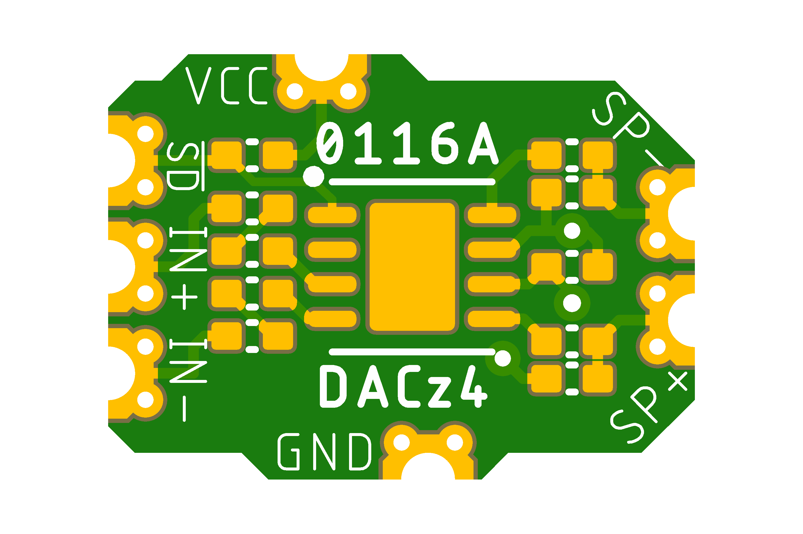
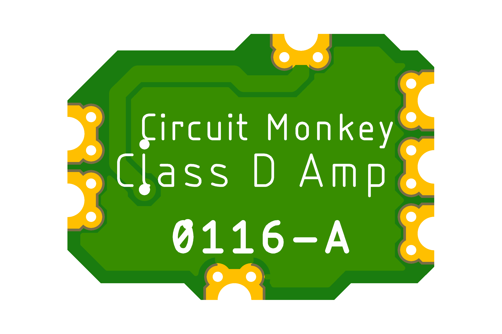

# Circuit Monkey CHIPs &#35;0116 -- Class-D Audio Amplifier

## Images
  

## Technical Details
* **Dimensions:** 11mm wide x 8mm tall  x 1.6mm PCB thickness
* **Pad Style:** Castellated Pin Edges allow easy surface mounting as well as hand wiring
* **Pad Pitch:** Minimum Pad Pitch is 2.0mm
* **Amplifier:** Diodes Inc. [PAM8302A Class-D type audio amplifier](Documents/3rd-party/Diodes_Inc-PAM8302A.pdf)
