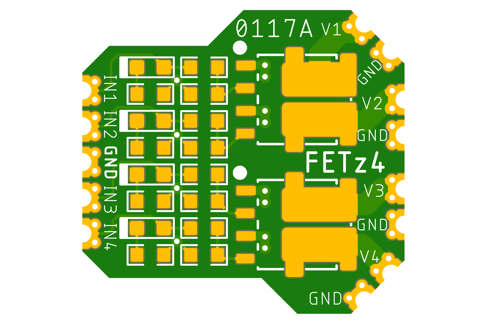
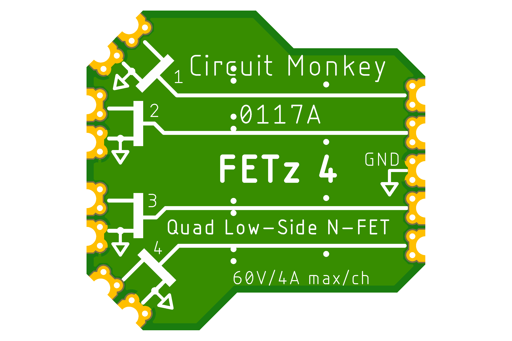

# Circuit Monkey CHIPs &#35;0117 -- Quad Low-Side FET

## Images
  

## Technical Details
* **Dimensions:** 18mm wide x 17mm tall  x 1.6mm PCB thickness
* **Pad Style:** Castellated Pin Edges allow easy surface mounting as well as hand wiring
* **Pad Pitch:** Minimum Pad Pitch is 2.0mm
* **FET (x2):** Vishay [SQJB68EP Dual N-Channel 100V@11A (D-S) FET](Documents/3rd-party/vishay-sqjb68ep.pdf)
