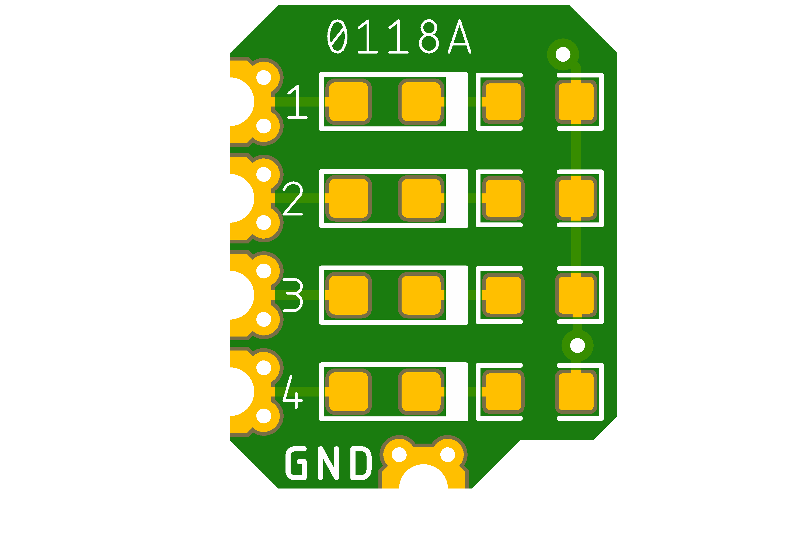
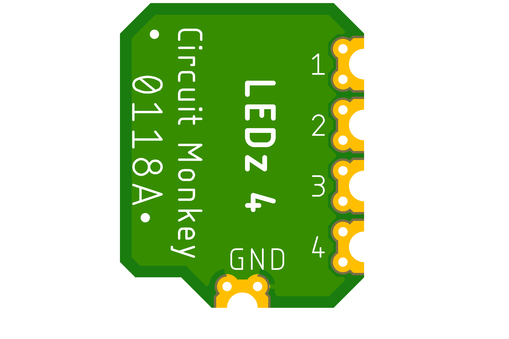
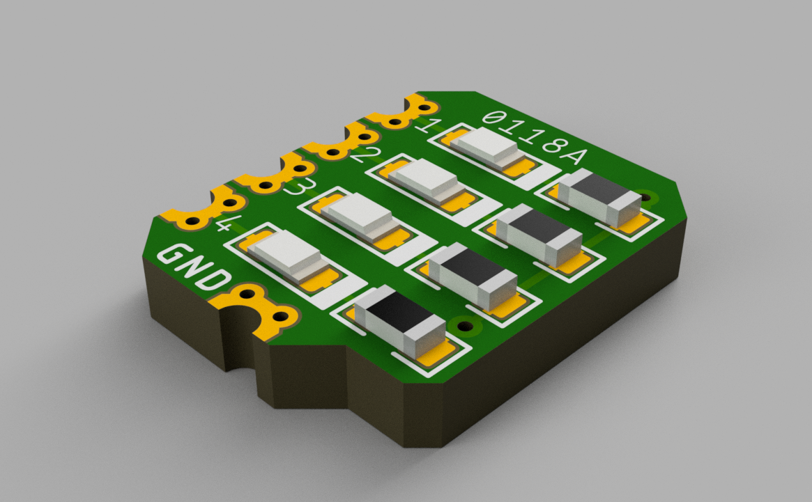

# Circuit Monkey CHIPs &#35;0118 -- Quad LED Indicator

## Images
  

## Technical Details
* **Dimensions:** 8mm wide x 10mm tall  x 1.6mm PCB thickness
* **Pad Style:** Castellated Pin Edges allow easy surface mounting as well as hand wiring
* **Pad Pitch:** Minimum Pad Pitch is 2.0mm
* **LEDs:** Standard 0603 size SMT LEDs in various colors.
