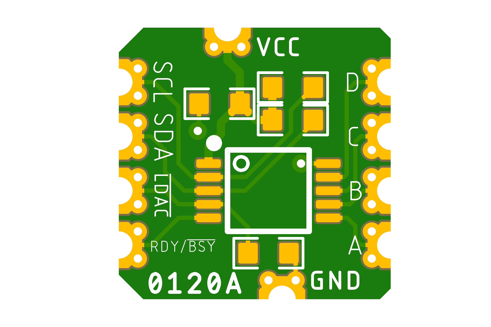
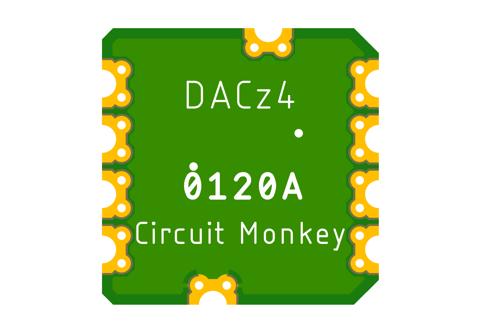

# Circuit Monkey CHIPs &#35;0120 -- 4-channel I2C DAC

## Images
  

## Technical Details
* **Dimensions:** 10mm wide x 10mm tall  x 1.6mm PCB thickness
* **Pad Style:** Castellated Pin Edges allow easy surface mounting as well as hand wiring
* **Pad Pitch:** Minimum Pad Pitch is 2.0mm
* **Amplifier:** Microchip [MCP4728 Digital to Analog Converter - 4channel](Documents/3rd-party/mcp4728.pdf)
