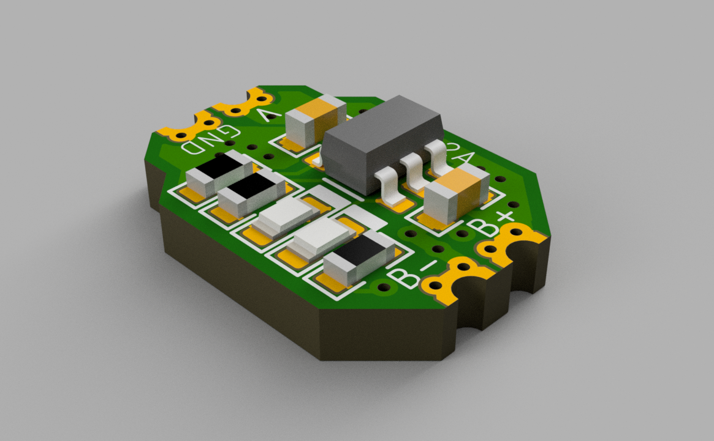
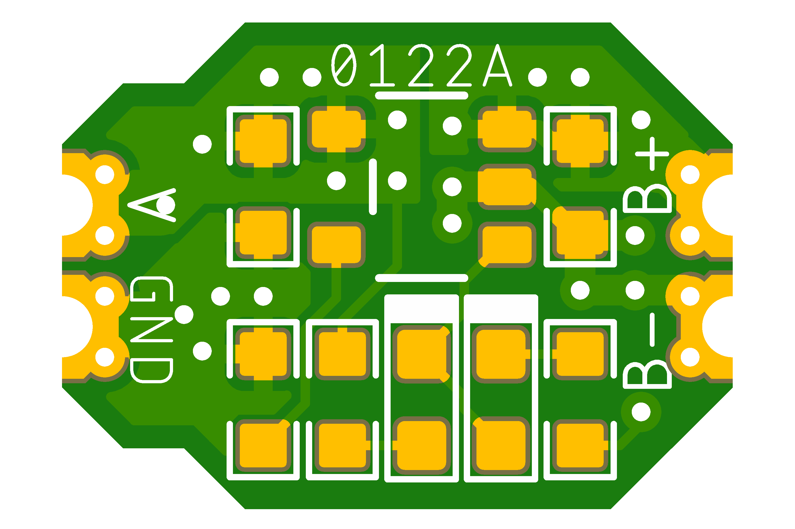
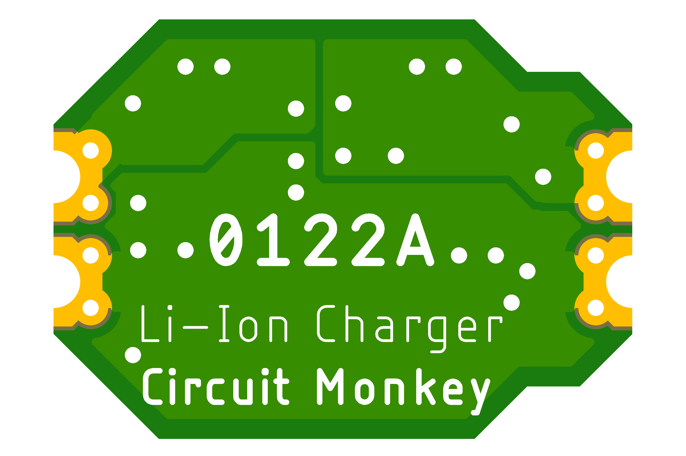

# Circuit Monkey CHIPs &#35;0122 -- LiIon Charger

## Images
  

## Technical Details
* **Dimensions:** 11mm wide x 8mm tall  x 1.6mm PCB thickness
* **Pad Style:** Castellated Pin Edges allow easy surface mounting as well as hand wiring
* **Pad Pitch:** Minimum Pad Pitch is 2.0mm
* **Chip:** Diodes Inc. [MCP73831 Li-Ion Charger](Documents/3rd-party/Microchip-MCP73831.pdf)
