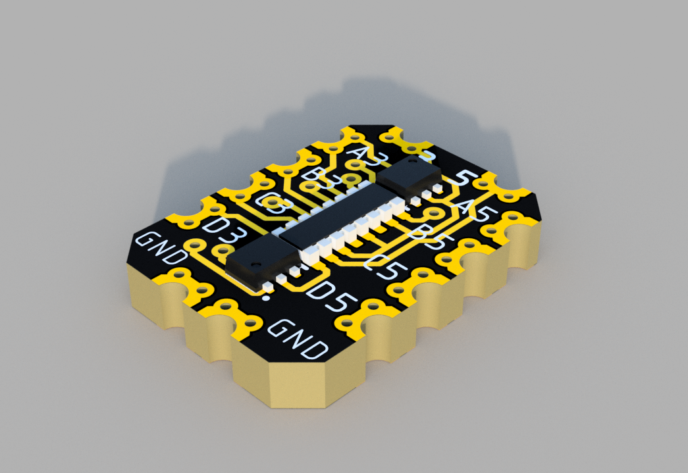
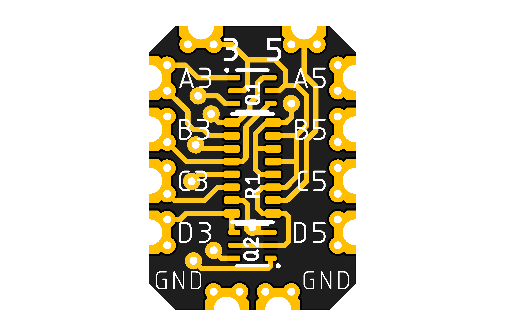
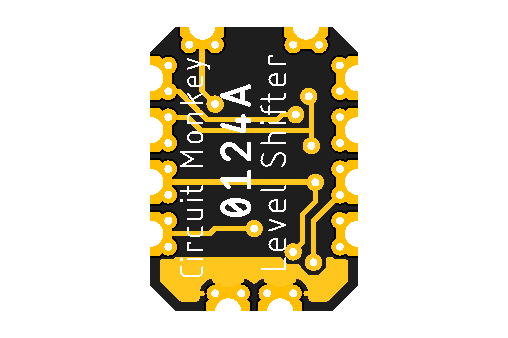

# Circuit Monkey CHIPs &#35;0124 -- Logic Level Shifter

## Images
  

## Technical Details
* For shifting logic levels between 3.3V and 5V signals (like mixed voltage I2C busses).
* **Dimensions:** 8mm wide x 11mm tall  x 1.6mm PCB thickness
* **Pad Style:** Castellated Pin Edges allow easy surface mounting as well as hand wiring
* **Pad Pitch:** Minimum Pad Pitch is 2.0mm
* **Chip:** Toshiba [SSM6N7002 Dual N-Fet](Documents/3rd-party/Toshiba_SSM6N7002BFE_datasheet.pdf)
