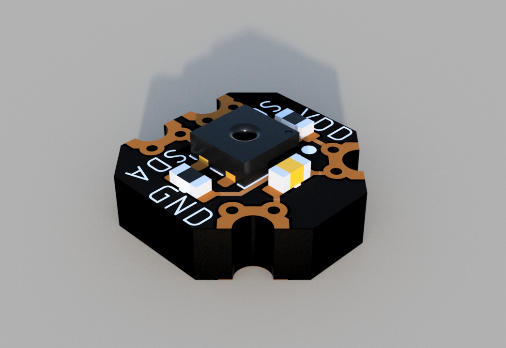
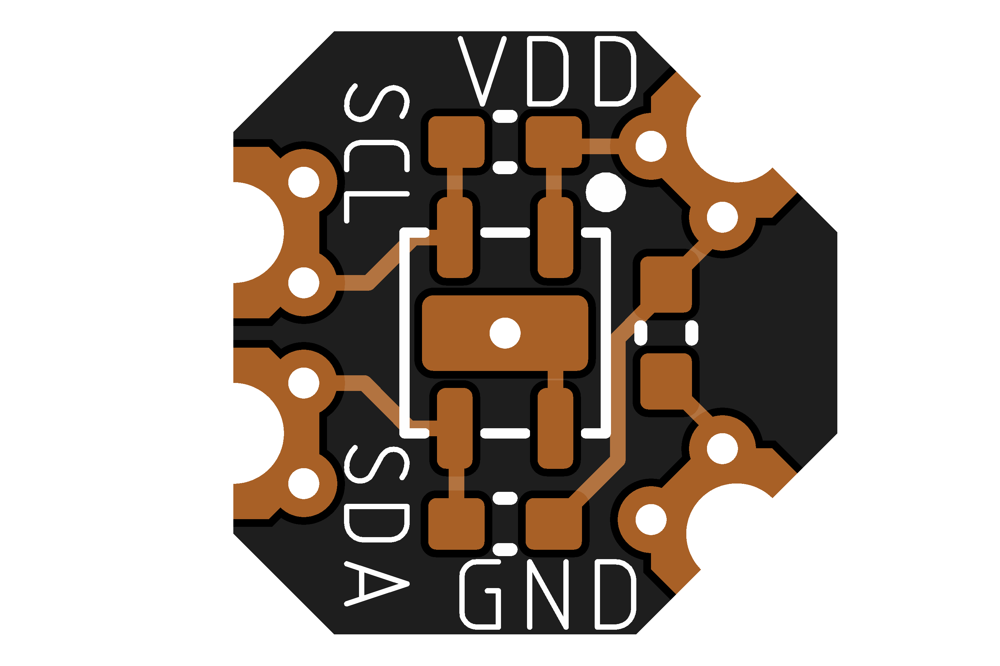
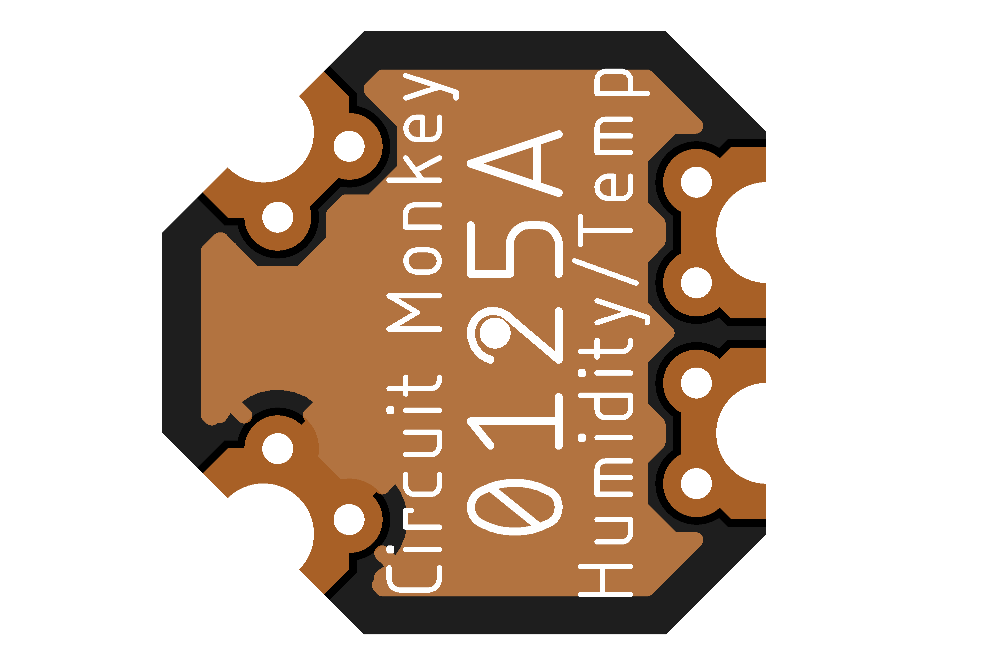

# Circuit Monkey CHIPs &#35;0125 -- Humidity and Temperature Sensor

## Images
  

## Technical Details
* **Dimensions:** 6mm wide x 6mm tall  x 1.6mm PCB thickness
* **Pad Style:** Castellated Pin Edges allow easy surface mounting as well as hand wiring
* **Pad Pitch:** Minimum Pad Pitch is 2.0mm
* **Chip:** Sensiron [SHTC3 Humidity Sensor](Documents/3rd-party/Sensiron_SHTC3_Datasheet.pdf)
